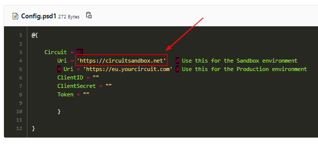
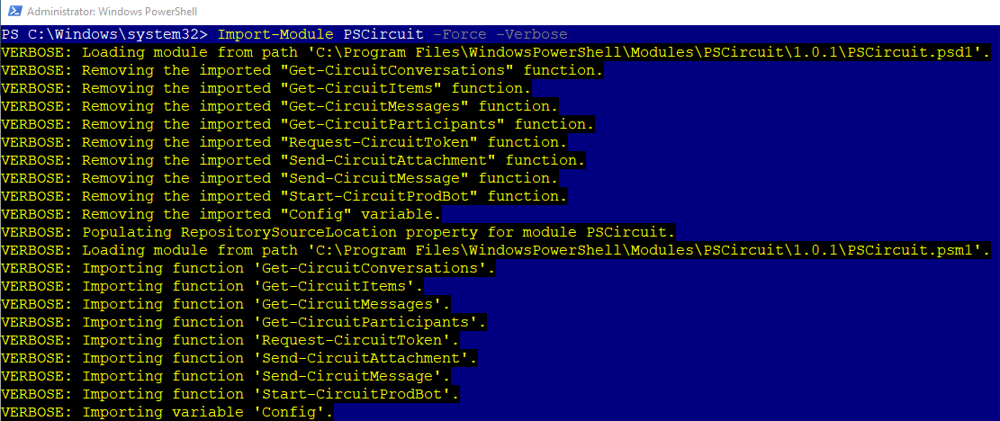

**How to use it in the Circuit Production Uri**

It's set to the Circuit Sandbox by default. It's very simple to change it, just edit the config file:

Replace `'https://circuitsandbox.net'` with `'https://eu.yourcircuit.com'`



if you find it too complicated, delete line 4 and 5 and replace with the following:

```powershell
        # Uri = 'https://circuitsandbox.net'   # Use this for the Sandbox environment
          Uri = 'https://eu.yourcircuit.com' # Use this for the Production environment
```

Save and Import the module again with the `-Force` parameter:
```powershell
Import-Module PSCircuit -Force -Verbose
```


Happy learning! - E3k