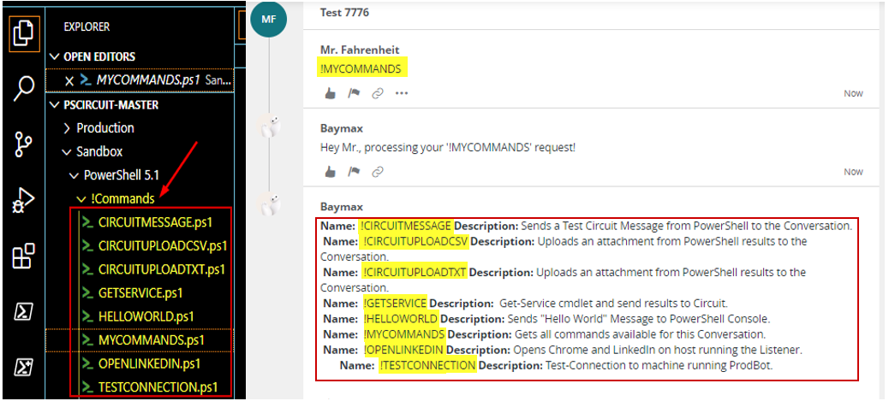
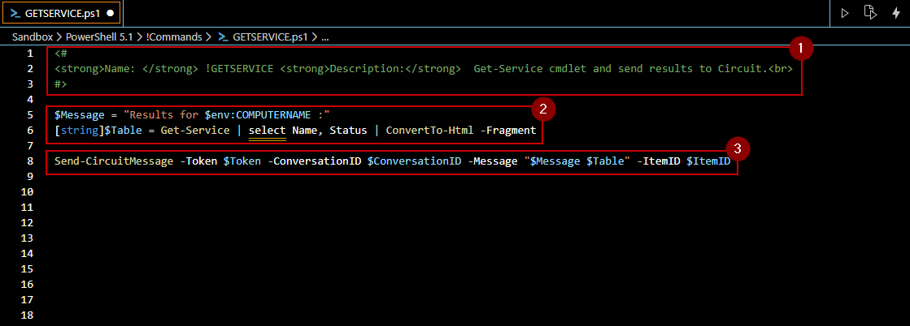
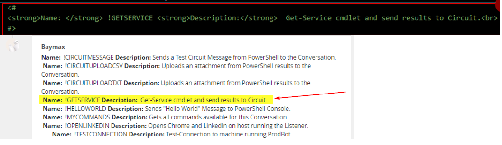
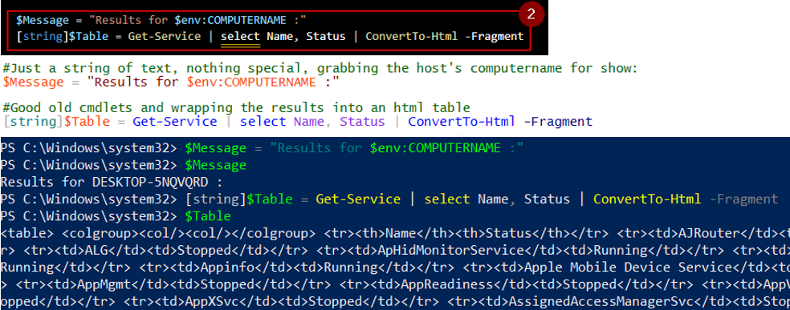
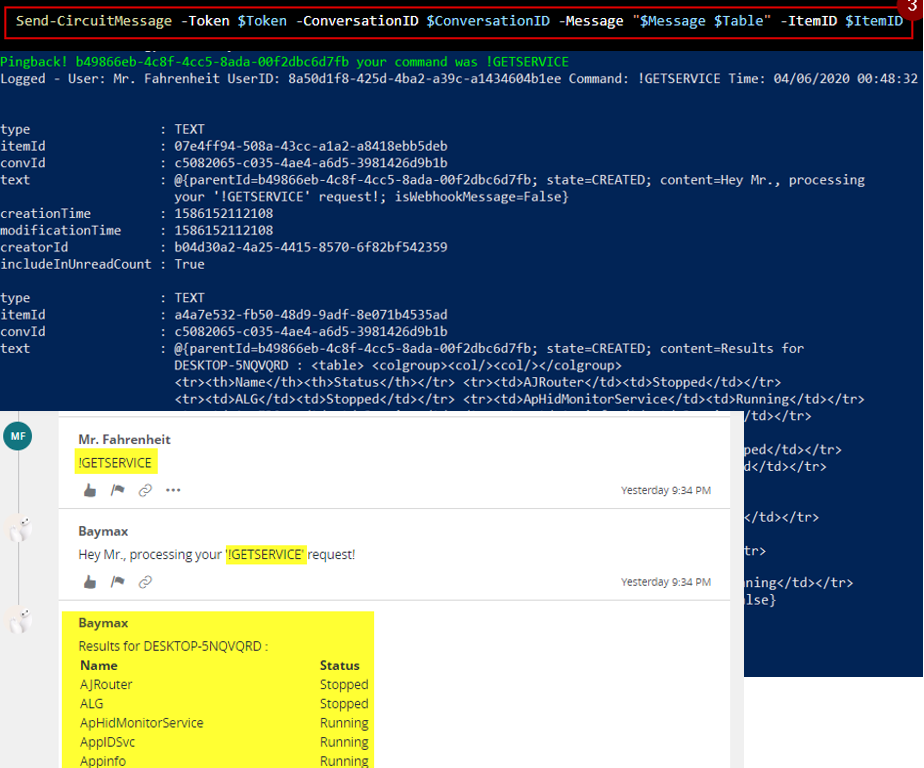

**About Keyword !Commands**

Keyword !Commands are nothing more than PowerShell scripts stored within a directory named *'!Commands'* inside the main PSCircuit Module Folder. 
Full paths: 

`.\PowerShell 5.1\!Commands` and `.\PowerShell 7\!Commands`.

PSCircuit automatically names the !Command after your script, based on the .ps1 file name. E.g. *"CIRCUITMESSAGE.ps1"* becomes the *"!CIRCUITMESSAGE"* keyword command in Circuit.



Any script within this folder will also inherit the following variables for your convenience:

```powershell
$Token          = Your last Oauth token stored
$ConversationID = The last convID string stored
$ItemID         = The ItemID to reply to the last message acknowledged by the Bot
```
The !Commands work by combining all the PowerShell stuff you already use and know plus the PSCircuit cmdlets to interact to and from Circuit. Let's look at "GETSERVICE.ps1".



**1.** This bit is what allows "!MYCOMMANDS" to pick up the Keyword Command and provides a simple html markup for the name and description:


  
**2.**  This is just plain old PowerShell. I'm storing a text string with the host's computername within a variable, then getting the Services' Name and Status and finally sending it as an html table fragment to display it inside the Circuit Conversation.



**3.** This is the PSCircuit cmdlet to respond back to the requester, notice I'm not declaring the $Token, $ConversationID and $ItemID variables, they are being inherited from the Listener itself.



A couple of things you should know:

*  Circuit takes some basic html, such as bold, tables etc. Luckily for us, PowerShell allows us to easily integrate this.
*  At the moment, !Commands don't take parameters, but it's something I've done already and it's easy to achieve, it will be a feature I will add soon.
*  !Commands (your .ps1 scripts) can be added and edited even while the listener is running, so no downtime is required.
*  Be wary that you may need to add a switch or if/else statement if you plan to use these behind a proxy, use the -AutoProxy switch for this cases. See [CircuitMessage.ps1](https://git.atosone.com/ericksevilla/pscircuit/-/blob/master/PowerShell%205.1/!Commands/CIRCUITMESSAGE.ps1) as an example of how to handle this scenario.

For now, that's it! I suggest you explore the other PowerShell scripts inside !Commands to get a basic idea of how you can integrate your existing scripts.

-E3k
