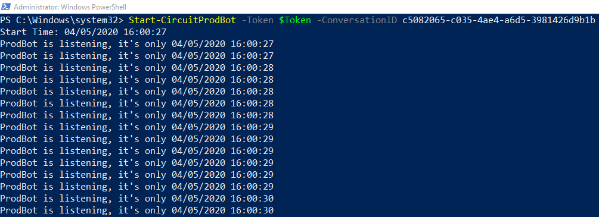
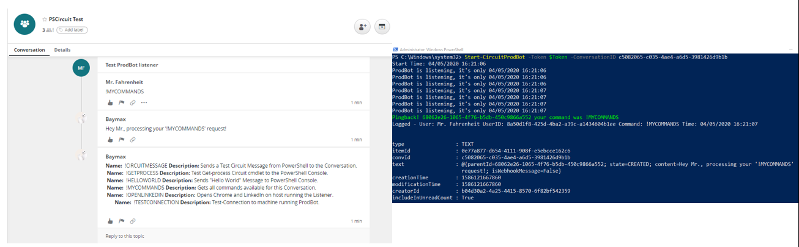

**Run Your ProdBot**

Once you have done the basic setup, running your Bot listener is pretty easy. You just need a token and the conversation ID you want it to listen to. If you've followed along the wiki so far, you may use the same we stored inside *$Token* from the [Test your Bot](https://git.atosone.com/ericksevilla/pscircuit/-/wikis/Test-your-Bot) page, else just get a new one by using `Request-CircuitToken` again.

Run the following making sure you replace the Conversation ID string with yours:

```powershell
Start-CircuitProdBot -Token $Token -ConversationID c5082065-c035-4ae4-a6d5-3981426d9b1b
```
You should see something like the following:



If you are behind a proxy, the cmdlets have an `-AutoProxy` switch, however this works for Windows OS only. The switch is available both for PowerShell 5.1 and 7.

```powershell
Start-CircuitProdBot -Token $Token -ConversationID c5082065-c035-4ae4-a6d5-3981426d9b1b -AutoProxy
```

PSCircuit comes with a few harmless Keyword !Commands already in place for testing, these are nothing more than simple PowerShell scripts, you may check what's available by sending the following message to the conversation "!MYCOMMANDS", the listener replies with the available Keyword Commands and a short description:



Remember, the scripts run where you have `PSCircuitStart/CircuitProdBot` installed/listening, so any actions are taken on that machine. You may run the listener on any local or remote machine and send the !Commands it via Circuit from any other device where you have access to the Conversation.


