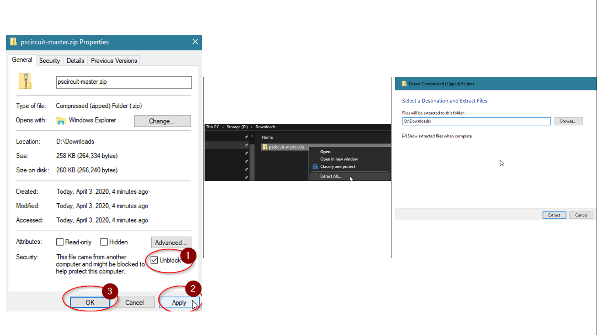

# Setup PSCircuit

**Steps to Setup PSCircuit**

If Online:

1. Open PowerShell as Admin.
2. Run the follwing:
```powershell
Install Module PSCircuit -Force
Import-Module PSCircuit -Force
```
If Offline:
1. Download the Module: [PSCircuit Zip](https://git.atosone.com/ericksevilla/pscircuit/-/archive/master/pscircuit-master.zip).
2. If using Windows, make sure you unblock the file.
3. Decompress (unzip) the contents to your directory of choice.
4. Launch PowerShell. ([How to Launch PowerShell](https://www.digitalcitizen.life/ways-launch-powershell-windows-admin))
5. Move to the directory where you decompressed the contents (in my case, `cd D:\Downloads`)
6. From PowerShell, run the following:
```powershell
Import-Module '.\pscircuit-master\PSCircuit.psd1' -Force
```

Validation:

1. To validate, run the following to display available commands:
```powershell
Get-Command -Module PSCircuit
```




