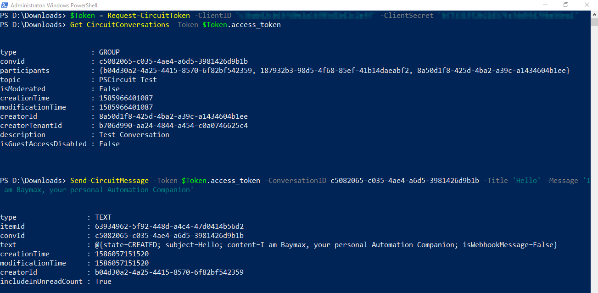
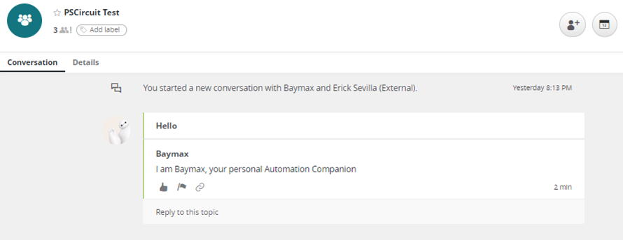

**Steps to Test your Bot's cmdlets**

*Note: If you need more info about the cmdlets, use "Get-Help", e.g.:* `Get-Help 'Request-CircuitToken' -Detailed`

Remember the Client ID and Client Secret we stored earlier? We'll use them now. Replace the values in quotes '*ClientId*' and '*ClientSecret*' below with them.

1. First, you'll need to get a token. Let's store it in a variable so we can reuse it:

```powershell
$Token = Request-CircuitToken -ClientID 'ClientId' -ClientSecret 'ClientSecret'
```

2. Now, let's get the list of Circuit Conversations the Bot is member of:

```powershell
Get-CircuitConversations -Token $Token.access_token
```

Notice the 'convId' property? That's the conversation ID, we'll need that to interact with the conversation directly. For the record, the "Get-CircuitConversations" cmdlet has a "-ConversationID" parameter you may use to lookup the details of a specific conversation.

3. Now that we have the convID, let's have the bot send our first message (no copyright infringements here):

```powershell
Send-CircuitMessage -Token $Token.access_token -ConversationID c5082065-c035-4ae4-a6d5-3981426d9b1b -Title 'Hello' -Message 'I am Baymax, your personal Automation Companion'
```





Here is a much cleaner version of the above to do a full run in one go:

```powershell
$ClientID     = 'dcxyyihfw8hta1s9onhld9bwmcsquq1m' # Replace this fake Client ID string
$ClientSecret = '5506fs0kaktr875lnb61r77zacw11m97' # Replace this fake Client Secret string
$Title        = 'Fist Bump!' # Title for new Circuit Item, replace this
$Message      = 'Balalala' # Message you want delivered, replace this

$Token = (Request-CircuitToken -ClientID $ClientID -ClientSecret $ClientSecret).access_token
$ConvId = (Get-CircuitConversations -Token $Token).convId

Send-CircuitMessage -Token $Token -ConversationID $ConvId -Title $Title -Message $Message
```

**Aftermath**

Et voilà! Congratulations!!! Your bot has sent its first message via PowerShell. There's a lot more you can do, in the next sections we'll go into having your bot run PowerShell scripts and into the anatomy of the rest of the cmdlets and how to use them. 

A word of advice before you go:

```css
****************************** WARNING ******************************
It is not a good idea to store your ID, Secret, OAuth Token,
credentials or any other sensitive data inside the code of a script

Without going into debates of what is good, bad or better,
it is preferable to use tools such as the Secrets Management Module,
Credential Manager, Ansible Vault, KeePass, Hashicorp Vault or any other method 
to encrypt and store credentials/secrets
**********************************************************************
```

Happy learning!

-E3k

